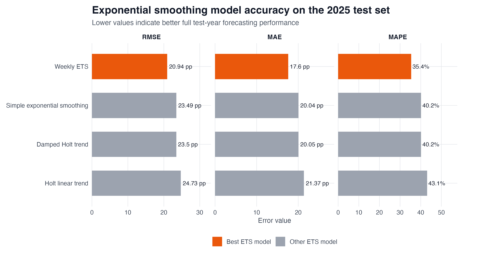
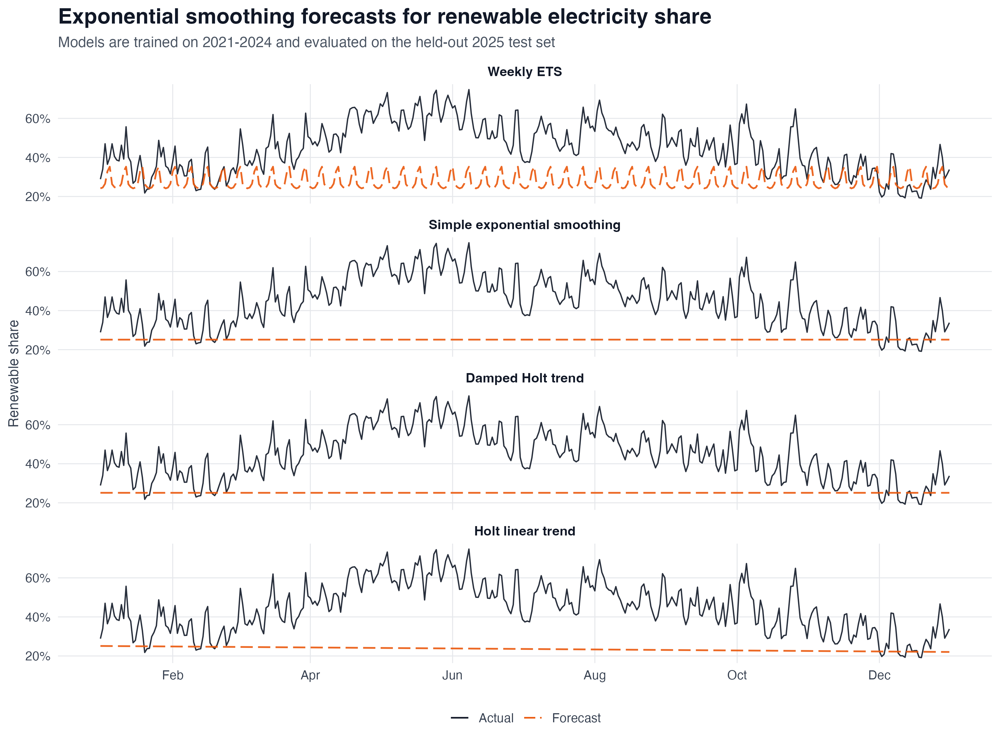
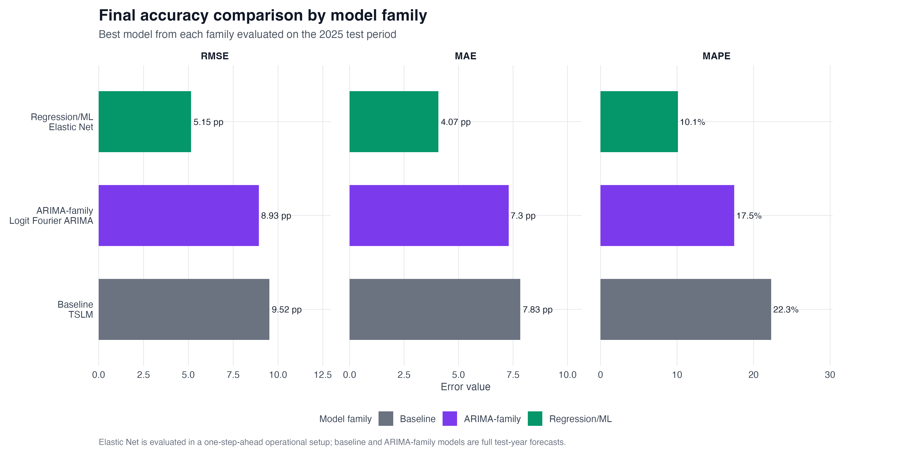
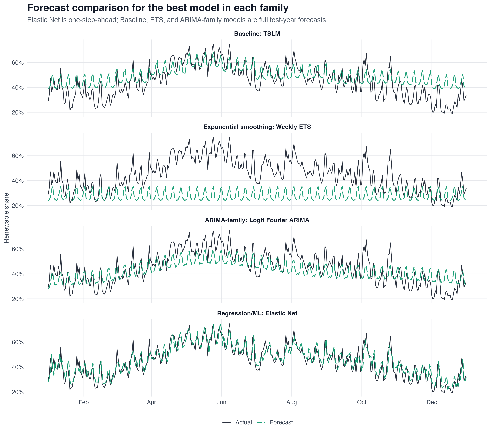
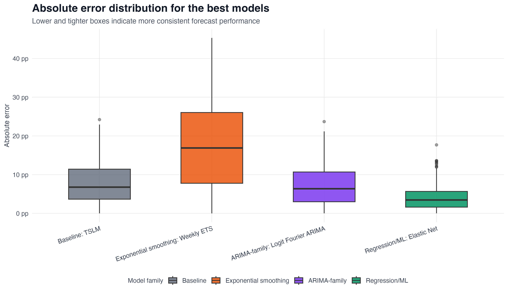
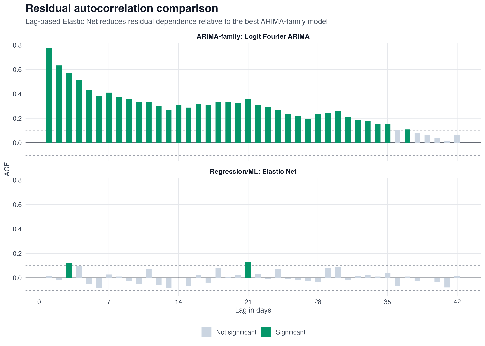
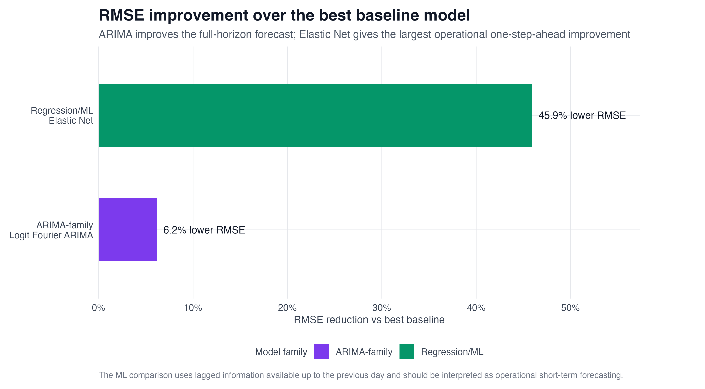
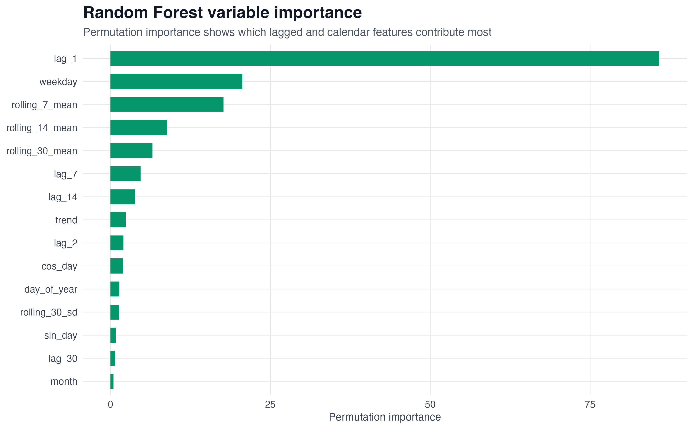

# Short-Term Forecasting of Italy's Renewable Electricity Share

This project forecasts Italy's daily renewable electricity share using official generation-mix data from Terna. The dataset is built from actual generation files, converted to daily energy values, and used to compare simple baselines, exponential smoothing models, ARIMA-family time-series models, and lag-based regression/ML models.

The goal is not only to get the lowest error. The project is designed to make the forecasting setup clear, especially because the models are evaluated under two different conditions: full test-year forecasting and one-step-ahead operational forecasting.

## Research question

Can Italy's daily renewable electricity share be forecast from historical generation-mix data, and which modelling approach performs best under a time-aware evaluation setup?

## Data

The raw data come from Terna's public Transparency Report / Download Center, using the **Actual Generation** dataset.

Raw Excel files are not stored in this repository. They are excluded through `.gitignore`, while the cleaned daily dataset and derived outputs are stored under `data/processed/`.

The final cleaned dataset covers:

- Daily observations from 2021-01-01 to 2025-12-31
- 1,826 complete daily records
- Generation sources including thermal, hydro, geothermal, photovoltaic, wind, and self-consumption
- A held-out 2025 test period for final evaluation

## Target variable

The target is the daily renewable electricity share, excluding self-consumption from the denominator:

```text
renewable_share_excl_sc =
(Hydro + Geothermal + Photovoltaic + Wind)
/
(Thermal + Hydro + Geothermal + Photovoltaic + Wind)
* 100
```

The raw Terna values were converted to daily energy values before aggregation. The final target is a percentage, so errors are interpreted in percentage points.

## Methodology

The pipeline is split into seven scripts.

| Script | Purpose |
|---|---|
| `01_clean_data.R` | Reads raw Terna Excel files, cleans source names and dates, converts generation values to daily energy, and creates the final daily dataset |
| `02_eda.R` | Explores trend, seasonality, weekday effects, generation mix, renewable composition, and autocorrelation |
| `03_baseline_models.R` | Fits benchmark models: mean, naive, weekly seasonal naive, previous-year naive, and TSLM |
| `04_exponential_smoothing_models.R` | Fits classical exponential smoothing benchmarks: Simple Exponential Smoothing, Holt trend, Damped Holt trend, and automatic Weekly ETS |
| `05_arima_models.R` | Fits ARIMA-family models, including SARIMA, Fourier ARIMA, dynamic regression with ARIMA errors, and logit-transformed bounded models |
| `06_regression_ml_models.R` | Fits lag-based regression and ML models: linear regression, Ridge, Lasso, Elastic Net, GAM, and Random Forest |
| `07_model_comparison.R` | Combines all model families, compares final results, calculates improvements, and creates the final summary figures |

## Forecasting setups

The project uses two forecasting setups.

### Full test-year forecast

The baseline, exponential smoothing, and ARIMA-family models are trained on 2021-2024 and evaluated on the full 2025 test year.

This setup is used for:

- Baseline models
- Simple Exponential Smoothing
- Holt and Damped Holt methods
- Weekly ETS
- ARIMA
- Weekly SARIMA
- Fourier ARIMA
- Logit Fourier ARIMA
- Dynamic regression with ARIMA errors

### One-step-ahead operational forecast

The regression/ML models predict each day in 2025 using lagged information available up to the previous day.

This setup is used for:

- Lagged linear regression
- Ridge regression
- Lasso regression
- Elastic Net
- GAM
- Random Forest

This distinction matters. The Elastic Net result should be interpreted as an operational day-ahead forecast, not as a direct full-horizon replacement for ARIMA.

## Main results

Models are ranked primarily by RMSE. MAE and MAPE are reported as complementary error measures.

| Model family | Best model | Forecasting setup | RMSE | MAE | MAPE |
|---|---|---|---:|---:|---:|
| Baseline | TSLM | Full test-year benchmark | 9.52 | 7.83 | 22.3 |
| Exponential smoothing | Weekly ETS | Full test-year forecast | 20.94 | 17.60 | 35.4 |
| ARIMA-family | Logit Fourier ARIMA | Full test-year forecast | 8.93 | 7.30 | 17.5 |
| Regression/ML | Elastic Net | One-step-ahead operational forecast | 5.15 | 4.07 | 10.1 |

The best full-horizon statistical model is **Logit Fourier ARIMA**. It improves on the best baseline by modelling weekly and annual seasonality through Fourier terms, while the logit transformation keeps the target within its natural 0-100% range.

The exponential smoothing benchmark is included for methodological completeness. The best model in this family is **Weekly ETS**, but it underperforms the best baseline. This suggests that simple smoothing of level and weekly seasonality is not sufficient for the daily renewable-share target.

The best operational one-step-ahead model is **Elastic Net**. Its performance is mainly driven by recent lagged renewable-share information, especially the previous day's value and short-term rolling features.

## Exponential smoothing benchmark

The project includes an exponential smoothing benchmark because ETS and Holt-Winters methods are classical short-term forecasting tools. The tested models are:

- Simple Exponential Smoothing
- Holt linear trend
- Damped Holt trend
- Weekly ETS



Weekly ETS is the best exponential-smoothing model, but it performs worse than TSLM, Logit Fourier ARIMA, and Elastic Net. It is therefore used as a benchmark and not as the final selected model.



The ETS forecast comparison shows that the exponential smoothing models underpredict much of the 2025 test period. This supports the use of ARIMA-family and lag-based models for this target.

## Final comparison







The final comparison shows a clear progression:

```text
Best baseline RMSE:                9.52
Best exponential smoothing RMSE:  20.94
Best ARIMA-family RMSE:            8.93
Best operational ML RMSE:          5.15
```

The ARIMA-family stage improves the full-horizon statistical forecast by capturing seasonal structure and respecting the bounded percentage target. The lag-based regression/ML stage gives the strongest operational result because recent observations contain useful short-term information.

## Residual diagnostics

Forecast accuracy alone is not enough, so the project also checks whether the residuals still contain serial dependence.



The best ARIMA-family model still leaves strong residual autocorrelation on the 2025 test period. The Elastic Net residuals are much closer to white noise:

| Model | Ljung-Box p-value |
|---|---:|
| Logit Fourier ARIMA | 0.000 |
| Elastic Net | 0.109 |

This supports the main modelling result: lag-based features reduce the short-term dependence that remains after ARIMA-family modelling.

## Improvement over baseline



Relative to the best baseline model:

- Logit Fourier ARIMA reduces RMSE by about **6.2%**
- Elastic Net reduces RMSE by about **45.9%** in the one-step-ahead operational setup

The exponential smoothing benchmark is not included in the improvement plot because it underperforms the best baseline.

The Elastic Net comparison uses more recent information, so it should be read as an operational forecasting result rather than a like-for-like full-horizon comparison.

## Feature importance

The Random Forest importance analysis confirms that the short-term lag structure is the main signal.



The most important predictor is `lag_1`, followed by weekly and short-term rolling features. This is consistent with the strong performance of the lag-based regression models.

## Repository structure

```text
renewable-share-forecasting-italy/
├── data/
│   ├── raw/
│   │   └── .gitkeep
│   └── processed/
│       ├── renewable_daily_clean.csv
│       ├── baseline_model_accuracy.csv
│       ├── ets_model_accuracy.csv
│       ├── arima_model_accuracy.csv
│       ├── ml_model_accuracy.csv
│       └── final_model_comparison.csv
├── figures/
│   ├── 01_renewable_share_trend.png
│   ├── ...
│   ├── 30_final_improvement_over_baseline.png
│   ├── 31_ets_forecast_comparison.png
│   ├── 32_ets_accuracy_ranking.png
│   ├── 33_best_ets_residuals.png
│   └── 34_best_ets_residual_acf.png
├── scripts/
│   ├── 01_clean_data.R
│   ├── 02_eda.R
│   ├── 03_baseline_models.R
│   ├── 04_exponential_smoothing_models.R
│   ├── 05_arima_models.R
│   ├── 06_regression_ml_models.R
│   └── 07_model_comparison.R
├── report/
│   ├── final_report.Rmd
│   └── final_report.pdf
├── README.md
├── .gitignore
└── renewable-share-forecasting-italy.Rproj
```

## Reproducibility

The scripts are designed to be run from the project root.

Install the required R packages:

```r
install.packages(c(
  "dplyr",
  "tidyr",
  "readr",
  "readxl",
  "janitor",
  "ggplot2",
  "lubridate",
  "forecast",
  "scales",
  "zoo",
  "glmnet",
  "mgcv",
  "ranger",
  "grid"
))
```

Then run the pipeline in order:

```r
source("scripts/01_clean_data.R")
source("scripts/02_eda.R")
source("scripts/03_baseline_models.R")
source("scripts/04_exponential_smoothing_models.R")
source("scripts/05_arima_models.R")
source("scripts/06_regression_ml_models.R")
source("scripts/07_model_comparison.R")
```

To render the report:

```r
rmarkdown::render("report/final_report.Rmd")
```

The raw Terna Excel files must be placed locally under `data/raw/` before running the cleaning script. They are intentionally not committed to the repository.

Expected raw file names:

```text
data/raw/terna_actual_generation_2021.xlsx
data/raw/terna_actual_generation_2022.xlsx
data/raw/terna_actual_generation_2023.xlsx
data/raw/terna_actual_generation_2024.xlsx
data/raw/terna_actual_generation_2025.xlsx
```

## Limitations

This project uses only historical generation-mix data. It does not include weather forecasts, electricity demand, market prices, holidays, or cross-border exchange variables.

The ML models are evaluated in a one-step-ahead setup, using lagged values available up to the previous day. This is useful for operational short-term forecasting, but it is not the same task as forecasting the entire 2025 test year in one step.

The target is renewable electricity share, not absolute renewable generation. This makes the forecast useful for studying generation-mix dynamics, but it does not directly forecast total renewable output.

Diffusion models such as Bass, GBM, and GGM were not used because the target variable is not cumulative adoption or market penetration. The project forecasts daily renewable electricity share, which fluctuates with weather, demand, and generation-mix conditions. Diffusion models would be more appropriate for long-term renewable technology adoption, such as cumulative installed solar or wind capacity, rather than short-term daily share forecasting.

A further machine-learning extension would be to test gradient boosting methods, such as XGBoost or gradient-boosted regression trees. They were not included in the final modelling pipeline because the current ML section already compares interpretable regularized regression, GAM, and Random Forest models, and the main objective was to keep the model comparison transparent and reproducible.

## References

- Terna, Actual Generation data, Transparency Report / Download Center  
  https://developer.terna.it/docs/read/apis_catalog/generation/Actual_Generation

- Hyndman, R. J. and Athanasopoulos, G., Forecasting: Principles and Practice — Time series cross-validation  
  https://otexts.com/fpp3/tscv.html

- Hyndman, R. J. and Athanasopoulos, G., Forecasting: Principles and Practice — Residual diagnostics  
  https://otexts.com/fpp3/diagnostics.html

- Hyndman, R. J. and Athanasopoulos, G., Forecasting: Principles and Practice — Dynamic harmonic regression  
  https://otexts.com/fpp3/dhr.html

- Hyndman, R. J. and Athanasopoulos, G., Forecasting: Principles and Practice — Exponential smoothing and ETS models  
  https://otexts.com/fpp3/ets.html

- Zou, H. and Hastie, T. (2005), Regularization and Variable Selection via the Elastic Net  
  https://academic.oup.com/jrsssb/article/67/2/301/7109482
